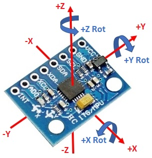

# Mono Propeller Drone

## connections

| PIN     | PORT    | USED          |
| :---    | :---    | :---          |
| D8      | PB0     | Fin 1         |
| D9      | PB1     | Fin 2         |
| D11     | PB3     | Fin 3         |
| D12     | PB4     | Fin 4         |
| D10     | PB2     | Propeller     |

## Arduino nano

# Sensors

### MPU6050

3 Axis Accelerometer and gyro

Dataseet: external link

Register map: external link
